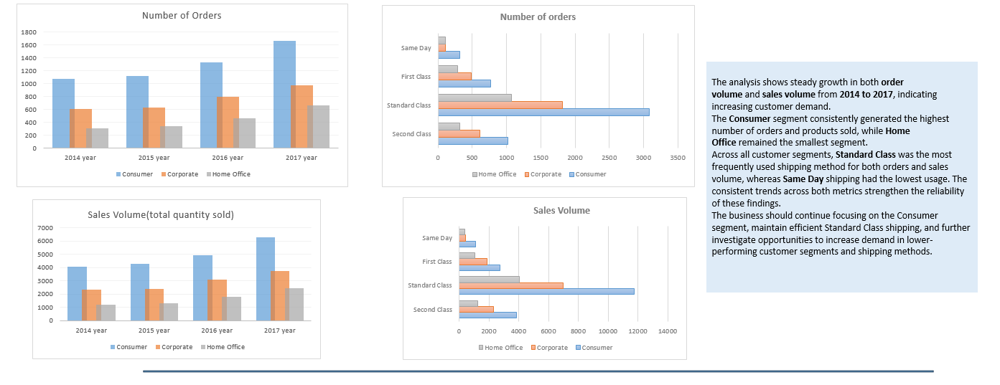
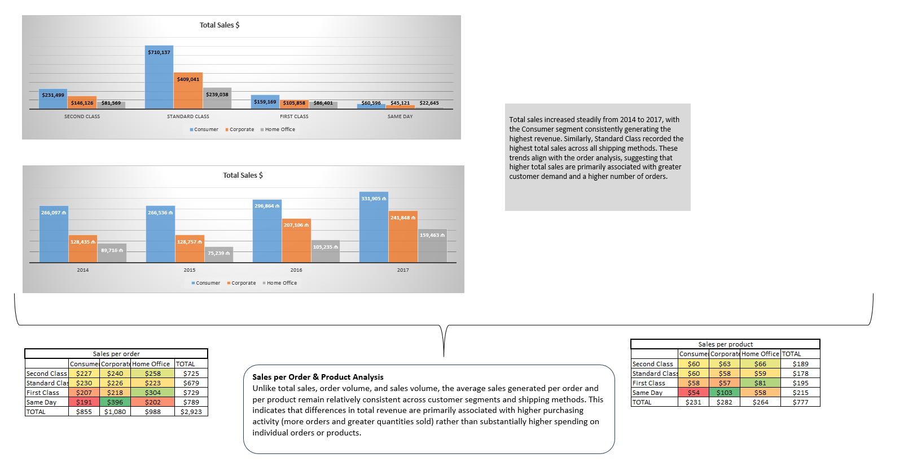

Retail Sales Performance Analysis in Microsoft Excel

An end-to-end Excel project demonstrating data cleaning, formula-based analysis, business reporting, and dashboard development using the Sample Superstore dataset.

📖 Project Overview

This project demonstrates a complete sales analysis workflow in Microsoft Excel using the Sample Superstore dataset.

The objective was to transform raw transactional data into meaningful business insights.

The project covers every stage of the analytical process, including data preparation, formula-based analysis, business reporting, and dashboard creation. Rather than relying on PivotTables, all summary tables were built manually using Excel formulas to strengthen analytical and reporting skills.

🎯 Project Objectives

The analysis focused on answering several business questions:

How are customer orders distributed across shipping methods and customer segments?
Which customer segments generate the highest sales?
How have sales, order volume, and product quantity changed over time?
How much revenue is generated per order and per product sold?
Are there any transactions that contain pricing inconsistencies?
How can analytical findings be communicated through effective data visualization?

📂 Dataset
Item	Details
Dataset	Sample Superstore
Tool	Microsoft Excel
Records	9,994 Transactions
Time Period	2014–2017

⚙️ Methodology
1. Data Preparation

The project began with preparing the raw dataset for analysis.

The following steps were completed:

Imported the CSV dataset into Microsoft Excel.
Converted the dataset into an Excel Table.
Checked for duplicate records using Remove Duplicates.
Verified that no duplicate records were found.
Checked for missing values in key columns.
Reviewed formatting consistency and overall data quality before beginning the analysis.

2. Data Enrichment

To extend the original dataset, three additional calculated columns were created.

Column	Description
Expected Sales	Calculated expected revenue using Unit Price × Quantity Sold
Sales Difference	Calculated the difference between reported sales and expected sales
Potential Anomaly Status	Classified each transaction as Valid, Underreported Sales, or Overreported Sales using a nested IF formula

3. Formula-Based Analysis

Instead of using PivotTables, every summary table was created manually.

Unique categories were generated using the Remove Duplicates feature, after which the analytical tables were populated using Excel formulas.

The following functions were used throughout the project:

COUNTIF
COUNTIFS
SUMIF
SUMIFS
IF
LEFT
Relative References
Absolute References (F4)

4. Business Analysis

The analysis was organized into logical business sections.

Customer & Shipping Analysis
Number of Orders
Quantity Sold
Total Sales by Shipping Method
Customer Segment Analysis
Sales Performance Analysis
Total Sales by Year
Order Count by Year
Quantity Sold by Year
Revenue Efficiency
Average Sales per Order
Average Sales per Product Sold
Transaction Validation
Expected Sales vs Reported Sales
Sales Difference
Potential Anomaly Classification

5. Dashboard Development

A dedicated dashboard sheet was created to present the analytical results through business-focused visualizations.

Charts were grouped by analytical topic, allowing related metrics to be interpreted together.

Each section of the dashboard includes written business conclusions summarizing the key findings.

# 📊 Dashboard Preview

The following screenshots highlight the final dashboards created during the project.

### Dashboard – Part 1

### Dashboard – Part 2

🛠 Excel Skills Demonstrated
Data Preparation
Data Cleaning
Excel Tables
Duplicate Validation
Missing Value Checks
Excel Functions
COUNTIF
COUNTIFS
SUMIF
SUMIFS
IF
LEFT
Relative References
Absolute References (F4)
Data Analysis
Formula-Based Reporting
Conditional Aggregation
KPI Calculation
Business Reporting
Transaction Validation
Data Visualization
Dashboard Design
Business Charts
Analytical Reporting

📚 What I Learned

Through this project, I strengthened my ability to perform an end-to-end analysis in Microsoft Excel. I practiced preparing and validating raw data, creating calculated fields, building analytical reports using formulas instead of PivotTables, designing dashboards, and communicating findings through concise business reports. This project also improved my understanding of how Excel can be used to support financial and business decision-making.

👩‍💻 About This Project

I completed this project as part of my Financial & Data Analytics portfolio to demonstrate practical Excel skills in data preparation, business analysis, dashboard development, and analytical documentation.
